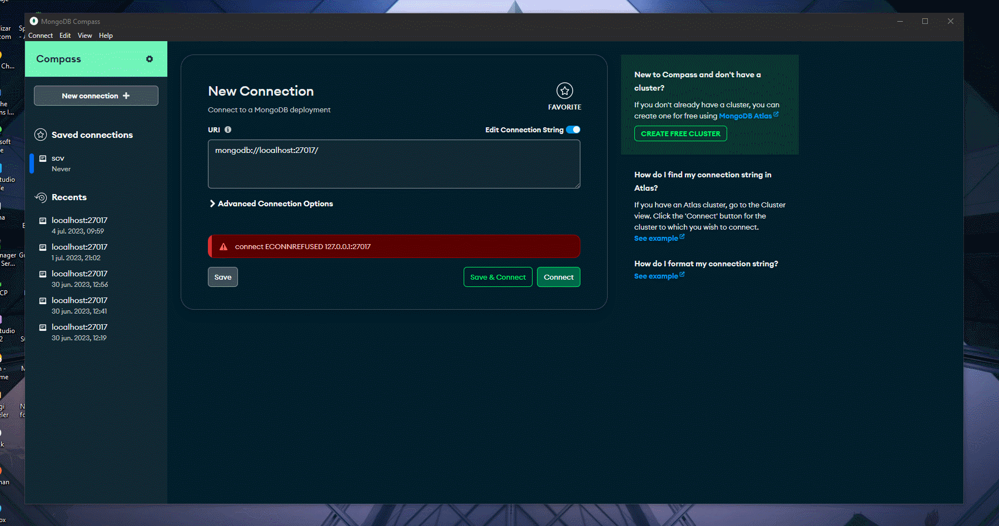

## Data Base

_Pagina Principal MongoDB Compas_

<table align="center">
  <tr>
    <td align="center" style="padding=0;width=50%;">
      
    </td>
  </tr>
</table>

## Comands

_ver las colecciones_

```
show collections
```

_ver las bases de datos

```
show db
show databases
```

_Insert Documents Example_

```
db.collection.insertOne({'nombre': 'brian', 'apellido':'marquez'})
db.collection.insertMany([{'nombre': 'brian1', 'apellido':'marquez1'}, {'nombre': 'brian2', 'apellido':'marquez2'}])
```

_Monstar Informacion_

```
db.collection.find()
```