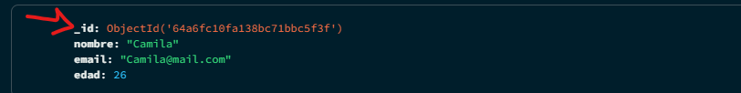

<h2 align="center"> 🍃 MongoDB Training 💪 </h2>

<p align="center">
  </a>
    
  </a>

  <a href="https://github.com/BrianMarquez3/MongoDB-Training/stargazers">
    
  </a>

  <a href="https://github.com/BrianMarquez3/MongoDB-Training$/network">
    
  </a>

  </a>
    
  </a>

  </a>
    
  </a>

  </a>
    
  </a>

  </a>
   <a href="https://github.com/BrianMarquez3/MongoDB-Training/network">
    
  </a><br>

  
</p>

<table align="center">
  <tr>
    <td align="center" style="padding=0;width=50%;">
      
    </td>
  </tr>
</table>

[Mongo DB Documentation](https://www.mongodb.com/cloud/atlas/lp/try4?utm_content=controlhterms&utm_source=google&utm_campaign=search_gs_pl_evergreen_atlas_core_prosp-brand_gic-null_amers-pe_ps-all_desktop_eng_lead&utm_term=mongodb&utm_medium=cpc_paid_search&utm_ad=e&utm_ad_campaign_id=12212624332&adgroup=115749719263&gclid=CjwKCAiA5Y6eBhAbEiwA_2ZWIcymNEvh9avFVdf8LQvjM4ZGdIyhyvFaYxPqMaWyZiPa_Yzgck78rhoCJD4QAvD_BwE)

## Table of Contents

| Numeration   | Check   |    Contents      |      Link      |
|:-----------:|:---------:|:---------------:|:--------------:|
|  001         | ✔️     | [Install Linux Ubuntu](#Install-Linux-Ubuntu)  | [⬅️ back](https://github.com/BrianMarquez3)| 
|  002         | ✔️     | [Install Windows](#Install-Windows)  |  [⬅️ back](https://github.com/BrianMarquez3)| 
|  003         | ✔️     | [Comands Linux Ubuntu](#Comands-Linux-Ubuntu)  |  [⬅️ back](https://github.com/BrianMarquez3)| 
|  004         | ✔️     | [Bases de Datos](#Bases-de-Datos)  |  [⬅️ back](https://github.com/BrianMarquez3)| 
|  005         | ✔️     | [Guardas Datos](#Guardas-Datos)  |  [⬅️ back](https://github.com/BrianMarquez3)| 
|  006         | ✔️     | [ObjectId Listar DOcumentos](#Object-ListaDocumentos)  |  [⬅️ back](https://github.com/BrianMarquez3)| 
|  007         | ✔️     | [Busqueda Avanzanda](#Busqueda-Avanzanda)  |  [⬅️ back](https://github.com/BrianMarquez3)| 
|  008         | ✔️     | [SQL en NoSQL](#SQL-en-NoSQL)  |  [⬅️ back](https://github.com/BrianMarquez3)| 

## Install Linux Ubuntu

<p>Install MongoDB Community Edition on Ubuntu</p>

📦 Install Ubuntu - [Install MongoDB](https://github.com/BrianMarquez3/MongoDB-Training/tree/main/install)
📦 Install Ubuntu - [Install MongoDB Community Edition on Ubuntu](https://www.mongodb.com/docs/manual/tutorial/install-mongodb-on-ubuntu/)

| Carpeta | Link    |  Code   | Version | Estado      | Home  |
|---------|:-------:|:-------:|:-------:|:-----------:|:-----:|
| [Install Ubuntu](https://github.com/BrianMarquez3/MongoDB-Training/tree/main/install) |✔️| yes | yes | ✔️ | [⬅️Atras](#Table-of-Contents) |

## Install Windows

📦 Install Windows - [Install MongoDB](https://www.mongodb.com/try/download/community)
📦 Install ROBO 3T - [Install ROBO 3T](https://robomongo.org/)
📦 Install The Smartest IDE for MongoDB - [Install Nosqlbooster](https://nosqlbooster.com/)

_use_

Visual Studio Code for the Web - [Visual Code Online](https://vscode.dev/)


## Comands Linux Ubuntu

_Iniciar_

```
sudo systemctl start mongod
sudo systemctl status mongod
sudo systemctl enable mongod
```

_ver las colecciones_

```
show collections
```

_ver las bases de datos

```
show db
show databases
```

_Insert Documents Example_

```
db.collection.insertOne({'nombre': 'brian', 'apellido':'marquez'})
db.collection.insertMany([{'nombre': 'brian1', 'apellido':'marquez1'}, {'nombre': 'brian2', 'apellido':'marquez2'}])
```

_Monstar Informacion_

```
db.collection.find()
```

## Bases de Datos

| Carpeta | Link    |  Code   | Version | Estado      | Home  |
|---------|:-------:|:-------:|:-------:|:-----------:|:-----:|
| [Creacion de Bases de datos](https://github.com/BrianMarquez3/MongoDB-Training/tree/main/BaseDatos) |✔️| yes | yes | ✔️ | [⬅️Atras](#Table-of-Contents) |

## Guardas Datos

| Carpeta | Link    |  Code   | Version | Estado      | Home  |
|---------|:-------:|:-------:|:-------:|:-----------:|:-----:|
| [Guardas Datos](https://github.com/BrianMarquez3/MongoDB-Training/tree/main/GuardasDatos) |✔️| yes | yes | ✔️ | [⬅️Atras](#Table-of-Contents) |

## ObjectId Listar DOcumentos

<table align="center">
  <tr>
    <td align="center" style="padding=0;width=50%;">
      
    </td>
  </tr>
</table>


## Busqueda Avanzanda


Metodos -  [Motodos](https://www.mongodb.com/docs/manual/reference/method/db.collection.findAndModify/)

_ejemplo Busqueda_

db.usuarios.find({})
db.usuarios.find({edad: {$gte: 30}})
db.usuarios.find({$and:[{nombre: "Camila"}, {nombre: "Camila"}]})

## SQL en NoSQL

_converte SQL TO NO SQL_

<table align="center">
  <tr>
    <td align="center" style="padding=0;width=50%;">
      
    </td>
  </tr>
</table>


--

## Books

_buy online_

🛒 Link - [The Definitive Guide 1st Edition](https://www.amazon.com/MongoDB-Definitive-Guide-Kristina-Chodorow/dp/1449381561)<br>
🛒 Link - [ The Definitive Guide: Powerful and Scalable Data Storage 3rd Edition](https://www.amazon.com/MongoDB-Definitive-Powerful-Scalable-Storage-dp-1491954469/dp/1491954469/ref=dp_ob_image_bk)

_Descarga_

<table>
  <tr>
      <td>Name</td>
      <td>Authors</td>
      <td>Editorial</td>
      <td>ISBN-10</td>
      <td>Link</td>
  </tr>

  <tr>
      <td>MongoDB: The Definitive Guide</td>
      <td>Kristina Chodorow,  Michael Dirolf</td>
      <td>O'REILLY</td>
      <td> 1449381561</td>
      <td><a href="https://ucsmedu-my.sharepoint.com/:b:/g/personal/47092136_ucsm_edu_pe/EYs4kdEEtlZDiFKsri12s50BXEWX5d_dk_-ygp9yI4Gsvg?e=b1HMeT">MongoDB: The Definitive Guide 1st Edition</a></td>
  </tr>

  <tr>
      <td>MongoDB: The Definitive Guide: Powerful and Scalable Data Storage 3rd Edition</td>
      <td>Kristina Chodorow,  Shannon Bradshaw</td>
      <td>O'REILLY</td>
      <td> 1491954469</td>
      <td><a href="https://ucsmedu-my.sharepoint.com/:b:/g/personal/47092136_ucsm_edu_pe/Eeyx3v5z6kRAnq-abxZprooBDnzEB9HxL_Lw0MQ4D_Oq0g?e=QwzE42">MongoDB: The Definitive Guide: Powerful and Scalable Data Storage 3rd Edition</a></td>
  </tr>
</table>

📚 Reposiory- [Book MongoDB Repository](https://github.com/BrianMarquez3/MongoDB-Training/tree/main/books)


## Spotify 

Music Development - [List on Spotify](https://open.spotify.com/playlist/11AwbhmXyh2jKlsHmaxcP9)


## Donate

_Paypal_

☕ Invitame un Cafe  [PAYPAL](https://www.paypal.com/donate?hosted_button_id=98U3T62494H9Y)


---

 <table align="center">
    <tr>
      <td colspan="3">A</td>
        <td>B</td>
      </tr>
      <tr>
        <td>C</td>
      <td colspan="2"></td>
        <td>E</td>
      </tr>
      <tr>
      <td colspan="3">F</td>
        <td>G</td>
    </tr>
</table>

